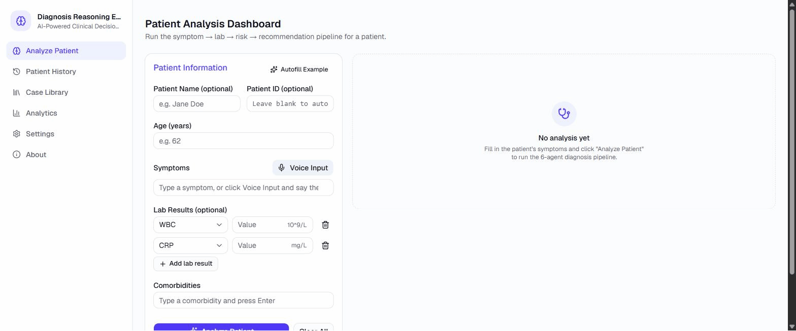

# 🩺 Diagnosis Reasoning Engine

**AI copilot for clinical triage** — a multi-agent decision-support system that turns a patient's
symptoms, labs, age, and comorbidities into a ranked differential diagnosis, a risk score, and a
recommended workup, with the reasoning behind every step shown explicitly instead of a black-box
answer.

[](https://github.com/sivasoundhar/DiagnosisReasoningEngine_AI/actions/workflows/deploy.yml)


[](LICENSE)

> ⚠️ **Not a medical device.** Educational and research use only — not a substitute for
> professional medical judgment.



---

## Contents

- [Why this exists](#why-this-exists)
- [Who it's for](#who-its-for)
- [Key features](#key-features)
- [How it works](#how-it-works)
- [Why three kinds of reasoning](#why-three-kinds-of-reasoning)
- [Tech stack](#tech-stack)
- [Getting started](#getting-started)
- [Usage example](#usage-example)
- [Testing](#testing)
- [Docker](#docker)
- [Real-data validation](#real-data-validation)
- [Project structure](#project-structure)
- [Documentation](#documentation)
- [License](#license)
- [Disclaimer](#disclaimer)

---

## Why this exists

Most "AI diagnosis" demos are a single LLM call producing an answer nobody can audit. This project
takes the opposite approach:

1. **A genuinely useful clinical reasoning tool** — fast, structured, explainable triage support,
   especially valuable where specialist access is limited or patient load is high.
2. **A demonstration of multi-agent AI system design done properly** — deterministic, data-driven
   reasoning where it should be auditable; genuine LLM reasoning layered on top where it adds real
   value; measured accuracy against real clinical data; and production concerns (Docker, CI/CD,
   109 automated tests) treated as first-class, not an afterthought.

## Who it's for

| Audience | What they get |
|---|---|
| 🏥 **Clinicians / triage nurses** | A fast, structured, explainable differential + risk read for a patient presentation — hands-free via voice input mid-examination |
| 📋 **Patient history / audit trail** | Every analysis is saved and searchable by patient; a clinician can attach their own confirmed diagnosis afterward to build a feedback record |
| 🧠 **Engineers studying multi-agent AI** | A clean, small, fully-tested reference for structuring a multi-step reasoning pipeline with LangGraph — including when *not* to reach for an LLM |

## Key features

- 🔗 **6-agent reasoning pipeline** — 4 deterministic, knowledge-base-driven agents + 2 independent LLM agents, orchestrated with LangGraph
- 📊 **Ranked differential diagnosis** with per-match confidence and plain-English reasoning
- 🚦 **LOW / MEDIUM / HIGH / CRITICAL risk scoring** with an auditable points breakdown
- 💊 **Recommended workup** — tests, treatments, and follow-up window, escalated by risk level
- 🤖 **AI second opinion** — an independent LLM take on the same raw case, shown side by side with the rule-based result
- 🕵️ **AI cross-check** — a second LLM agent that reviews and critiques the rule-based result itself (agrees / partially agrees / disagrees, plus concerns)
- 🎙️ **Voice input** — speak symptoms instead of typing them, with medical-vocabulary-aware correction
- 🖨️ **Printable clinical reports**, patient history lookup, and aggregated analytics
- ✅ **Validated against real clinical case data** (DDXPlus) — not just unit tests

## How it works

```
You (type or speak) → symptoms, age, comorbidities, labs
        │
        ▼
┌─────────────────┐   "What could this be?"
│ Symptom Analyzer │   Matches symptoms against a knowledge base, ranks candidate diagnoses
└────────┬─────────┘
         ▼
┌─────────────────┐   "What do the labs say?"
│ Lab Interpreter  │   Flags abnormal values against normal/critical reference ranges
└────────┬─────────┘
         ▼
┌─────────────────┐   "How urgent is this?"
│  Risk Assessor   │   Scores age + comorbidities + diagnosis severity + red-flag symptoms
└────────┬─────────┘
         ▼
┌─────────────────┐   "What should happen next?"
│   Recommender    │   Tests, treatments, follow-up window — escalated by the risk level
└────────┬─────────┘
         ▼
┌─────────────────┐   "What's an independent AI take on this same case?"
│  AI Reasoner     │   Calls an LLM (Groq) with the ORIGINAL input only — never the 4 steps
│                  │   above — for a genuinely independent second opinion
└────────┬─────────┘
         ▼
┌─────────────────┐   "Does the rule-based result actually hold up?"
│  AI Critic       │   Shown the rule engine's OWN diagnosis/risk/recommendation and asked to
│                  │   critique it — agrees / partially agrees / disagrees, plus any concerns
└────────┬─────────┘
         ▼
   Ranked diagnosis + risk score + action plan + full reasoning trail +
   AI second opinion + AI cross-check verdict
```

```
┌────────────┐   HTTP/JSON   ┌─────────────────────┐   in-process   ┌───────────────────┐
│  React UI   │ ────────────▶│  FastAPI (src/main)  │──────────────▶│  6-agent pipeline   │
│ (frontend/) │◀──────────── │  /analyze /history … │◀────────────── │  (diagram above)     │
└────────────┘               └──────────┬───────────┘                └─────────┬─────────┘
                                         │                                       │ ai_reasoner +
                                         ▼                                       ▼ ai_critic only
                                 ┌───────────────┐                    ┌───────────────────┐
                                 │ SQLite (data/) │                    │  Groq API (LLM)     │
                                 └───────────────┘                    └───────────────────┘
                                 every analysis saved for /history, /analytics
```

Full system design, data flow, and every field explained: [`docs/ARCHITECTURE.md`](docs/ARCHITECTURE.md).

## Why three kinds of reasoning

The four core agents are **deterministic and knowledge-base-driven on purpose** — symptom→diagnosis
scoring, lab reference-range interpretation, risk-factor point totals, and recommendations all come
from versioned JSON (`src/knowledge/`), not a model call, so every number the app produces traces
back to an explicit rule ([`docs/MEDICAL_KB.md`](docs/MEDICAL_KB.md)). That auditability matters for
a clinical tool.

But a rule-based pipeline alone doesn't *reason* the way "AI" usually implies, so two more agents
add genuine LLM reasoning on top — and deliberately do **opposite jobs**:

- **AI Reasoner is blind on purpose.** It never sees the rule engine's answer, because showing an
  LLM another system's conclusion before asking its opinion invites *anchoring bias* — models tend
  to agree with whatever they're shown first. It produces one genuinely uncontaminated data point,
  returned as `ai_opinion`.
- **AI Critic is informed on purpose.** It's shown the rule-based `diagnoses` / `risk_assessment` /
  `recommendation` and asked to critique that specific result — an unprimed opinion structurally
  cannot say "that recommended CT looks excessive" or "the risk score didn't weight this
  comorbidity," because it never saw those choices. Returned as `ai_critique`.

One agent alone gives you either an unaccountable second opinion or an agreeable, possibly-biased
critique; together they triangulate — the same blind-review + informed-critique split used in real
LLM evaluation work. Both are strictly **supplementary, not authoritative**: without a
`GROQ_API_KEY`, `ai_opinion`/`ai_critique` are simply `null` and the rule-based result is still a
complete answer on its own.

## Tech stack

| Layer | Stack |
|---|---|
| Backend | FastAPI · LangGraph (6-agent `StateGraph` pipeline) · SQLite · Pydantic |
| AI / LLM | Groq (`langchain-groq`) — powers the AI Reasoner and AI Critic agents |
| Frontend | React 19 · TypeScript · Vite · Tailwind CSS v4 · shadcn/ui |
| Voice | Web Speech API (`SpeechRecognition` + `SpeechSynthesis`, browser-native) |
| Infra | Docker (multi-stage build) · GitHub Actions CI/CD |
| Testing | pytest (109 hermetic tests — no test hits the real Groq API) |

## Getting started

**Prerequisites:** Python 3.11+, Node 20+ (Docker optional — see [Docker](#docker))

```bash
# Clone
git clone https://github.com/sivasoundhar/DiagnosisReasoningEngine_AI.git
cd DiagnosisReasoningEngine_AI

# Backend
python -m venv .venv
.venv\Scripts\activate          # Windows
# source .venv/bin/activate     # macOS/Linux
pip install -r requirements.txt
cp .env.example .env            # defaults work out of the box

# Frontend (separate terminal)
cd frontend
npm install
cp .env.example .env
```

**Run it** (two terminals):

```bash
# Terminal 1 — backend
uvicorn src.main:app --reload
# → http://localhost:8000/health   → {"status": "healthy"}
# → http://localhost:8000/docs     → interactive API docs (Swagger UI)

# Terminal 2 — frontend
cd frontend && npm run dev
# → http://localhost:5173
```

Both need to be running together — the frontend calls the backend via `VITE_API_URL`. Open the app,
click **"Autofill Example"** → **"Analyze Patient"** and you should see a full result in about a
second.

**Want the AI second opinion / cross-check enabled?** Get a free key at
[console.groq.com](https://console.groq.com), set `GROQ_API_KEY` in `.env`, restart the backend.
Without it, `ai_opinion`/`ai_critique` are simply `null` — everything else works normally.

## Usage example

```bash
curl -X POST http://localhost:8000/analyze \
  -H "Content-Type: application/json" \
  -d '{
    "symptoms": ["fever", "cough", "shortness of breath"],
    "age": 62,
    "labs": {"WBC": 12.5, "CRP": 8.5},
    "comorbidities": ["diabetes"]
  }'
```

Returns a ranked diagnosis (e.g. *Pneumonia, 100% confidence*), a risk score (e.g. *CRITICAL, 80
points*, with the points broken down), a recommended workup, the full reasoning chain, plus — if
`GROQ_API_KEY` is set — an independent AI second opinion and an AI cross-check verdict on the
rule-based result. Full response shape and every field explained in
[`docs/API.md`](docs/API.md).

## Testing

```bash
pytest -v              # 109 tests: all 6 agents, supervisor, every API endpoint
cd frontend && npm run build   # TypeScript check + production build
```

All tests are hermetic — a fake LLM is injected for the AI agents and `GROQ_API_KEY` is force-cleared
for the test session, so the suite never hits the real Groq API even if your local `.env` has a key.

## Docker

```bash
docker build -t diagnosis-ai:latest .
docker run -p 8000:8000 --env-file .env diagnosis-ai:latest
```

Or the full stack in one command:

```bash
docker compose up --build
```

Image details and the deployment checklist: [`docs/DEPLOYMENT_NOTES.md`](docs/DEPLOYMENT_NOTES.md).

## Real-data validation

Validated against 20 real patient cases from the [DDXPlus](https://github.com/mila-iqia/ddxplus)
dataset — one case per condition the app is designed to recognize. **75% plausible-or-better**
(35% exact top-diagnosis match, 40% correct diagnosis present in the differential). Full
methodology, per-case results, and honest failure analysis in
[`docs/TEST_RESULTS.md`](docs/TEST_RESULTS.md). Reproduce with `python scripts/validate_ddxplus.py`.

## Project structure

```
src/
├── main.py                    # FastAPI app: /health, /analyze, /history/{id}, /feedback, /analytics
├── config.py                  # Pydantic Settings (reads .env)
├── database.py                 # SQLAlchemy models + session + auto-migration
├── models.py                    # Pydantic request/response schemas
├── agents/                       # 6 agents, each a 2-node LangGraph StateGraph
│   ├── base_agent.py               # Abstract BaseAgent all 6 inherit from
│   ├── symptom_analyzer.py           # Symptoms -> ranked differential diagnosis (rule-based)
│   ├── lab_interpreter.py             # Lab values -> abnormal-finding interpretations (rule-based)
│   ├── risk_assessor.py                # Age/comorbidities/diagnosis -> LOW..CRITICAL score (rule-based)
│   ├── recommender.py                   # Diagnosis + risk -> tests/treatments/follow-up (rule-based)
│   ├── ai_reasoner.py                    # Independent LLM (Groq) second opinion
│   └── ai_critic.py                       # LLM cross-check of the rule-based result
├── orchestrator/
│   └── supervisor.py            # Outer LangGraph wiring all 6 agents into one pipeline
└── knowledge/                   # The actual "brain" - versioned JSON, not hardcoded logic
    ├── medical_kb.py               # KnowledgeBase loader + symptom-synonym normalization
    ├── symptoms.json                 # 29 symptoms -> candidate diagnoses
    ├── labs.json                      # 15 labs, normal/critical ranges + interpretations
    ├── conditions.json                 # 21 condition definitions + tests/treatments/follow-up
    ├── risk_factors.json                # Scoring weights for the Risk Assessor
    └── recommendations.json              # Risk-level escalation rules for the Recommender

frontend/src/
├── pages/                      # Analyze, Patient History, Case Library, Analytics, Settings, About
├── components/                  # PatientForm, ResultsDisplay, PrintReport, MicButton, etc.
├── hooks/useSpeechRecognition.ts   # Web Speech API wrapper
└── lib/                         # Form state, fuzzy matching, date formatting, theme, etc.

scripts/validate_ddxplus.py    # Real-data validation harness
tests/                          # 109 pytest tests across all 6 agents + supervisor + API
docs/                           # ARCHITECTURE, API, MEDICAL_KB, TEST_RESULTS, DEPLOYMENT_NOTES
data/                           # DDXPlus dataset (gitignored - large; used for validation only)
```

## Documentation

| Doc | What's in it |
|---|---|
| [`docs/ARCHITECTURE.md`](docs/ARCHITECTURE.md) | System design, agent pipeline, data flow |
| [`docs/API.md`](docs/API.md) | Endpoint reference with example requests/responses |
| [`docs/MEDICAL_KB.md`](docs/MEDICAL_KB.md) | Knowledge base structure and how to extend it |
| [`docs/TEST_RESULTS.md`](docs/TEST_RESULTS.md) | Real-data validation methodology + results |
| [`docs/DEPLOYMENT_NOTES.md`](docs/DEPLOYMENT_NOTES.md) | Docker details + deployment checklist |
| [`docs/PROJECT_GUIDE.md`](docs/PROJECT_GUIDE.md) | The full "read this first" deep-dive doc |

## License

[MIT](LICENSE) — free to use, modify, and build on.

## Disclaimer

Educational and research use only. **Not a medical device.** Not a substitute for professional
medical judgment. Always consult a qualified healthcare provider.
